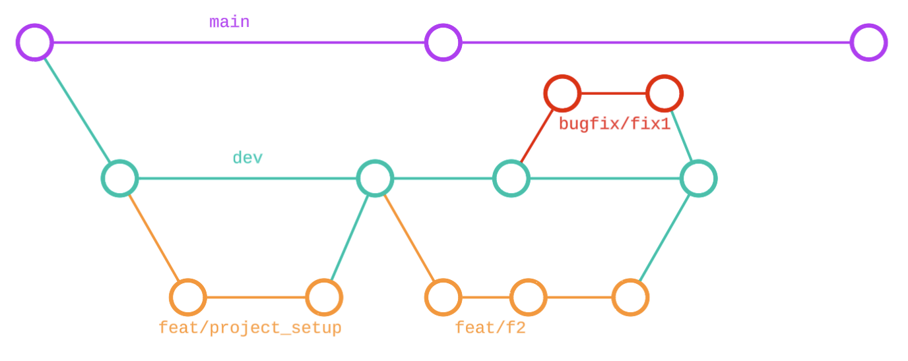

# Travel Agent

## Branching Strategy

This project follows the following branching strategy:
- `main` is the primary branch that represents the production-ready code
- `dev` is the integration branch for all feature development
- `feat/*` are short lived branches created for developing specific features
- `bugfix/*` are also short lived branches created for fixes in preparing releases

